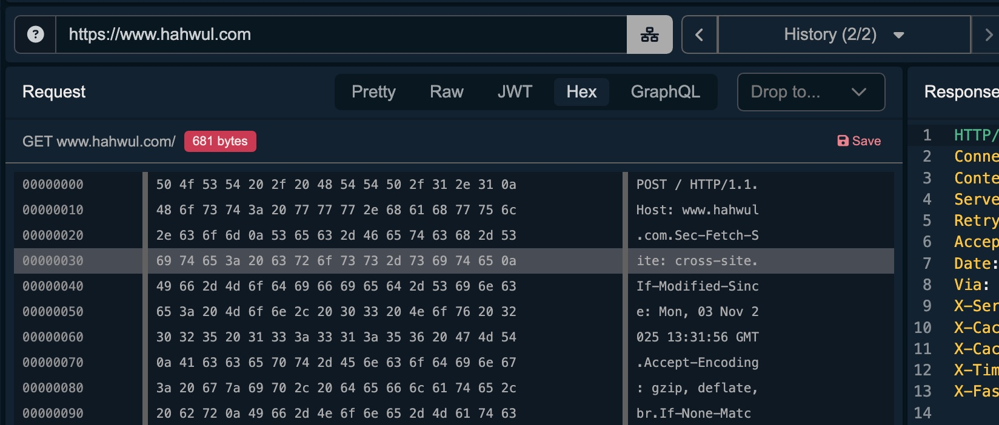
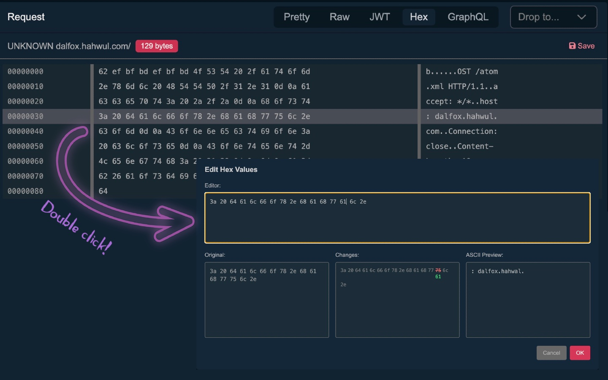

# Hex

Hex Viewer & Editor Plugin for [Caido](https://caido.io/)



## Features

- **Hex Viewer** (History, Replay tabs)
- **Hex Editor** (History, Replay tabs)


*Double-click any line in the hex view to edit its contents directly.*

## Installation

1. Grab the latest plugin_package.zip from our Releases page.
2. In Caido, go to the Plugins page.
3. Click Install Package and select the file you just downloaded.

## Development

To build the plugin from the source code:

```bash
git clone https://github.com/hahwul/Hex
cd Hex
pnpm install
pnpm build
```

## Special Thanks
To Michael([@dyrandy](https://github.com/dyrandy)), whose quiet persistence finally won. This plugin’s here because you asked nicely... a lot. 😉
