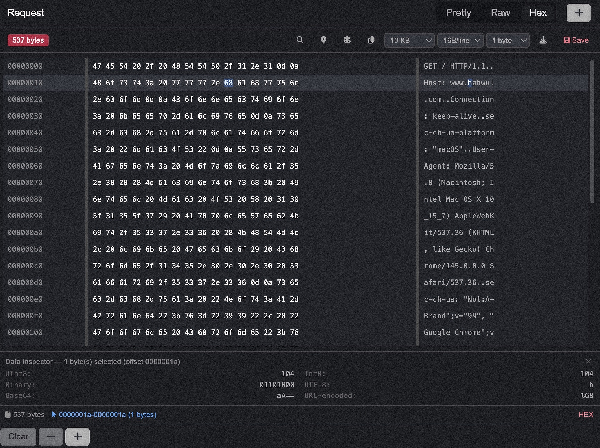
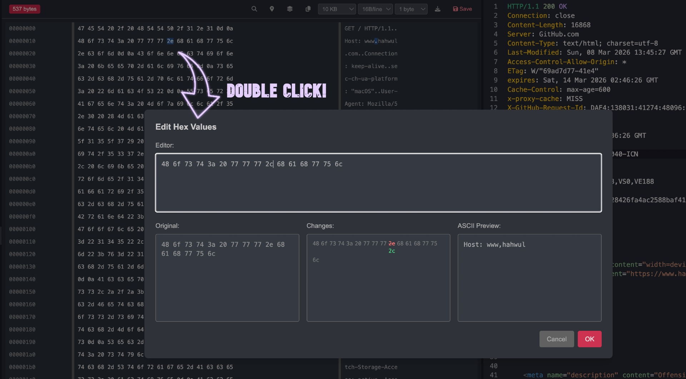

# Hex

A Hex Viewer & Editor plugin for [Caido](https://caido.io/).



## Features

- **Hex Viewer** — View hex representation of request/response bodies in History and Replay tabs
- **Hex Editor** — Double-click any line to edit hex values directly
- **Search** — Search Hex and ASCII data
- **Go to offset** — Jump to a specific offset
- **HTTP structure highlighting** — Highlights boundary between headers and body
- **Copy as...** — Copy data as raw hex, spaced hex, C array, Python bytes, JSON array, or Hexdump
- **Export binary data** — Download binary data
- **Data Interpretation Panel** — Inspect values as numbers, text, base64, url-encoded, etc.



## Installation

### Community Store (Recommended)

1. Go to **Plugins** > **Community Store** in Caido.
2. Search **"Hex"** and click **Install**. ✨

### Manual

1. Download `plugin_package.zip` from the [Releases page](https://github.com/hahwul/Hex/releases).
2. Go to **Plugins** > **Install Package** and select the file.

## Development

```bash
git clone https://github.com/hahwul/Hex
cd Hex
pnpm install
pnpm build
```

| Command | Description |
|---------|-------------|
| `pnpm build` | Build the plugin |
| `pnpm watch` | Build with hot-reload |
| `pnpm test` | Run all tests |
| `pnpm test:coverage` | Run tests with coverage |
| `pnpm lint` | Run linter |
| `pnpm typecheck` | Run type checker |

## Important Note

This plugin was created as a temporary convenience tool until official support for **Hex View** and **Edit** features is implemented in Caido. Once the related issue is resolved (see [caido/caido#29](https://github.com/caido/caido/issues/29)), this plugin will likely become unnecessary.

Until then, feel free to use it to improve your workflow!

## Special Thanks
To Michael([@dyrandy](https://github.com/dyrandy)), whose quiet persistence finally won. This plugin’s here because you asked nicely.. a lot. 😉
